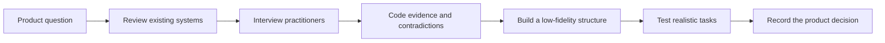

# Frontend Index: Choosing UI Patterns With More Confidence

- **Status:** Study ready; participant research has not started
- **My role:** Research planning, interview and test design, synthesis, and communication
- **Product stage:** Early concept
- **Planned timeline:** Four weeks
- **Partners:** Product design, frontend engineering, design systems, and accessibility

## The Short Version

Frontend Index is an idea for a searchable library of UI patterns. It would bring design guidance, accessibility behavior, edge cases, and implementation notes into one place.

The question I want to answer is straightforward: **what information do designers and developers need before they trust a UI pattern enough to use it?**

I would start with interviews about recent pattern decisions, then test a low-fidelity structure before anyone invests in a polished product. The ideas on this page are starting hypotheses, not findings.

## Why I Chose This Problem

Finding an example is easy. Deciding whether that example fits the situation is harder.

A designer may need to understand the user problem and interaction states. A developer may be looking for browser behavior, accessibility requirements, or maintenance risk. Both may use several sources before they feel comfortable moving forward. If the guidance is incomplete, the result can be rework, inconsistent patterns, or an avoidable accessibility problem.

## What I Need To Learn

1. How do people begin a pattern search during real project work?
2. What makes an example feel trustworthy or questionable?
3. Where do designer and developer needs overlap?
4. Can people find and compare patterns using the proposed structure?
5. Do they notice accessibility guidance while making the decision?

## Scope

I would study search, comparison, trust, accessibility guidance, and design-to-development handoff. I would not use this study to claim production adoption, long-term trust, or code quality across every framework. Those questions need a working product and different evidence.

The working constraints are a four-week schedule, six discovery interviews, and five prototype sessions. Sessions would be remote, and participants could use the accessibility tools and communication methods that work for them.

## Why These Methods

| Method | What It Helps Me Learn |
| --- | --- |
| Competitive review | How existing systems organize guidance and which assumptions are worth testing |
| Recent-experience interviews | How people made an actual pattern decision, including workarounds and trust signals |
| Low-fidelity tree and task testing | Whether labels and grouping work before visual design gets in the way |
| Prototype sessions | Whether the revised content helps someone make and explain a realistic choice |

The competitive review gives me useful context, but it cannot tell me what users need. That is why it comes before interviews instead of replacing them.

## Participants

I would recruit three UX or product designers and three frontend or design-system engineers. Each person must have selected, reviewed, or implemented a reusable web pattern within the last three months.

I also want variation in experience, company context, and accessibility practice. Six interviews can reveal useful behavior and differences, but they cannot tell me how common something is across the whole industry.

The [recruitment screener](recruitment-screener.md) shows the exact criteria and exclusion logic.

## Participant Care And Data

- Share the purpose, activity, time, incentive, and recording request before scheduling.
- Pay people for their time, including anyone who chooses to stop early.
- Ask about accommodations before the session.
- Get separate permission for recording and for any public, de-identified excerpt.
- Keep contact information separate from research notes.
- Never publish recordings, names, or private company information.

## How I Would Analyze The Sessions

I would tag notes with the research question and keep three things separate: what happened, what the participant said about it, and what I think it means.

The first code set covers search behavior, trust, comparison, accessibility, implementation risk, and handoff. I expect that code set to change once real data comes in. I would also keep contradictory examples instead of smoothing them into a cleaner story.

The [synthesis framework](synthesis-framework.md) shows how each finding would connect back to its evidence.

## Starting Hypotheses

- People may search by task or outcome more often than by component name.
- Usage guidance, edge cases, accessibility behavior, and maintenance history may affect trust.
- Designers and developers may share the same high-level questions but need different levels of detail.
- Accessibility guidance may be missed when it lives on a separate page.

These statements give the study something to challenge. They are not conclusions.

## Prototype Tasks

1. Find a pattern for filtering a content-heavy page.
2. Decide whether it fits a scenario with keyboard and screen-reader requirements.
3. Compare two reasonable options and explain the tradeoff.
4. Find what an engineer would need before implementation.
5. Share the decision with another product-team role.

I would record whether the task was completed independently, the path taken, mistakes, accessibility barriers, the evidence used, and how the participant explained the choice. Time is useful context, but it is not the only measure of success.

## How The Research Could Change The Product

| If The Research Shows... | I Would Recommend... | How I Would Check It |
| --- | --- | --- |
| People begin with goals instead of component names | Lead with task-based navigation | Participants find the right starting point without help |
| Trust depends on behavior, accessibility, and constraints | Require those fields on every pattern page | Participants can explain when to use and avoid a pattern |
| The two roles need different detail after a shared summary | Use expandable role-specific sections | Both roles find useful detail without missing shared requirements |
| Comparing options is a normal part of the decision | Continue testing side-by-side comparison | Participants can explain a choice using information on the page |

The [decision log](decision-log.md) records what the team adopts, tests, delays, or declines. A recommendation is not an outcome until something changes.

## Measuring The Work

First, I would look at whether the research helped the team make the intended product decision. Then I would test whether people could find a pattern, understand when to use it, notice the accessibility guidance, and explain their choice.

If the product were built, later measures could include unsuccessful searches, repeated documentation visits, clarification requests during handoff, pattern reuse, and defects caused by pattern misuse. I would need a baseline before connecting any change to the work.

## Limitations

- A small, selected sample gives depth, not a market estimate.
- A low-fidelity prototype cannot test production performance or long-term use.
- What people remember about their workflow may differ from what they actually do.
- My frontend background may make me pay more attention to implementation concerns. I would use peer review and actively look for evidence that challenges that bias.

## Project Files

- [Research plan](../../research-plans/frontend-index-research-plan.md)
- [Recruitment screener](recruitment-screener.md)
- [Competitive review](competitive-review.md)
- [UX designer interview guide](../../interview-guides/ux-designer-interview-guide.md)
- [Frontend developer interview guide](../../interview-guides/frontend-developer-interview-guide.md)
- [Low-fidelity prototype specification](prototype-spec.md)
- [Synthesis framework](synthesis-framework.md)
- [Decision log](decision-log.md)
- [Research readout outline](research-readout.md)
- [Short case-study version](../../case-studies/frontend-index-research-case-study.md)

## Next Step

I would pilot the interview with one eligible participant, fix any unclear questions, and then run the six planned interviews. The hypotheses above would only become findings if the evidence supports them.
