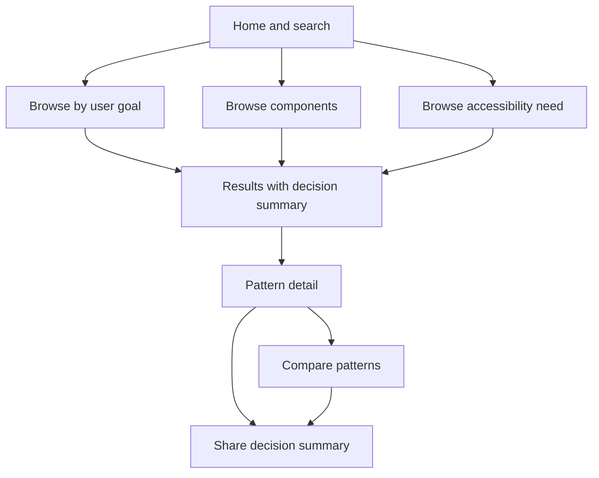

# Frontend Index Low-Fidelity Prototype Specification

- **Status:** Research stimulus based on planning hypotheses; not a validated design
- **Prototype question:** Can practitioners find, evaluate, compare, and communicate a pattern decision using this structure?
- **Fidelity:** Content-first wireframe; visual design and production behavior are intentionally out of scope

## Information Architecture

The prototype will also include unsuccessful search, no-comparison selection, and return-to-results paths so the study does not test only an ideal journey.

## Search Result Card

Each result exposes enough context to support an informed next step:

| Field | Purpose | Research Question |
| --- | --- | --- |
| Pattern name and purpose | Establish basic relevance | Can participants distinguish similar patterns? |
| User goal | Support task-oriented retrieval | Do participants begin with goals or taxonomy? |
| Appropriate and inappropriate contexts | Surface tradeoffs before selection | Does this information change the choice? |
| Accessibility summary | Make impact visible in the primary flow | Is it discovered and understood? |
| Complexity and maturity | Signal implementation and maintenance risk | Which trust signals matter? |
| Compare action | Support explicit alternatives | Is comparison part of real workflow? |

## Pattern Detail Content Model

1. Purpose and user problem
2. When to use
3. When not to use and alternatives
4. Interaction anatomy and required states
5. Keyboard and assistive-technology expectations
6. Content and error guidance
7. Responsive and performance constraints
8. Framework-neutral behavior
9. Implementation examples by technology
10. Testing and acceptance criteria
11. Version, owner, review date, and source evidence
12. Related and commonly confused patterns

This order is provisional. Task testing should reveal whether participants require a different summary, sequence, or role-specific depth.

## Comparison View

The comparison view will show two patterns across user goal, strengths, risks, accessibility behavior, implementation constraints, and avoid conditions. It will not assign an unexplained overall score; participants must be able to see and challenge the basis of a recommendation.

## Shareable Decision Summary

The generated summary includes scenario, considered patterns, selected option, rejected alternative, rationale, accessibility requirements, implementation constraints, unresolved questions, owner, and review date. The study will test whether this supports cross-role handoff or merely creates additional documentation.

## Planned States

- Default, hover, focus, selected, unavailable, and error states
- Empty and zero-result search
- Incomplete documentation warning
- Deprecated or replaced pattern
- Accessibility evidence under review
- Framework implementation unavailable
- Comparison with missing fields

## Accessibility Requirements For The Research Stimulus

- Logical headings and landmarks
- Keyboard-operable search, filters, comparison, and disclosure controls
- Visible focus and no focus loss after filtering
- Programmatic names and status announcements
- Zoom and reflow without loss of content or action
- Reduced-motion behavior
- Plain-language error and recovery guidance
- No accessibility-critical information conveyed by color alone

## Version And Change Log

| Version | Change | Evidence Or Rationale | Status |
| --- | --- | --- | --- |
| 0.1 | Initial task, component, and accessibility entry points | Competitive-review hypotheses | Ready for expert review |
| `[Version]` | `[Change]` | `[Evidence IDs or constraint]` | `[Status]` |

## What Would Cause The Team To Stop Or Pivot

- Participants cannot distinguish patterns from components.
- Comparison does not match real decision behavior.
- Required fields create more maintenance effort than decision value.
- Accessibility detail remains undiscovered or is interpreted as a guarantee.
- A simpler documentation improvement resolves the decision without a new product.
